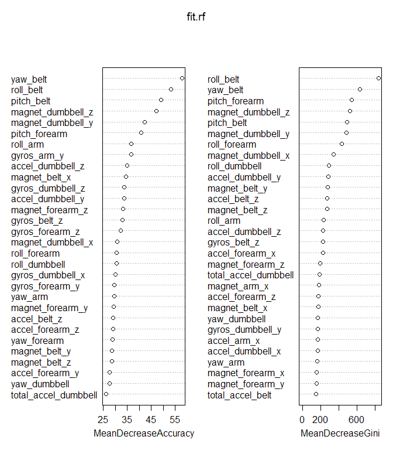

# Qualitative Human Activity Recognition via Supervised Learning


<style>
  img {
    display: block;
    margin: 0 auto;  
  }

  p.caption {
    width: 80%;
    margin-left: 20%; margin-bottom: 2em;
    padding-top: 0.5em;
    text-align: right;
    font-size: 120%;
    font-weight: bold;
    color: #666;
    border-top: 1px solid #ccc;
  }

  #TOC {
    width: 80%;
    background: #f6f6f6;
    padding: 2em 0 2em 0;
  }
</style>

## Introduction

As part of the "quantified self" movement, the gathering of personal activity data is becoming more and more ubiquitous. An emerging frontier is the challenge of not merely quantifying, but qualifying "how well" an activity is performed. *Velloso et. al. (2013)* provides a raw dataset of activity sensor readings from a worn censors for users performing biceps curls in one of five different ways. We use supervised learning to tackle the classification problem: given a set of indicators, can we build a model that predicts the correct "class" of bicep curl performed?

## Supervised learning approach
There are a broad range of supervised machine learning methods available to us. We say it is *supervised* because we make use of a provided set of answers -- that is, the knowledge of a certain set of indicator data empirically known to result from a certain categorical outcome. We call it *learning* because we use this provided data to inform and create a model that is able to predict outcomes for general, future indicator data.

All models are wrong (George Box, 1976), but some may be useful. To quantify usefulness, we estimate **out of sample** error, or the error rate of the prediction model on new data. As not all new data can be known, we can only provide an estimate, and we do so by partitioning the data into separate **train** and **validate** sets; the former exclusively used to build the model, and the latter exclusively to estimate out of sample error.

## Background
In *Velloso et. al.*, six male participants aged 20 to 28 with little weightlifting experience were fitted with sensors and asked to perform a 1.25kg dumbbell biceps curl according to one of the following designations:

* **Class A**: textbook ('correct') form
* **Class B**: elbows thrown forward
* **Class C**: halfway curl raise
* **Class D**: halfway curl lowering
* **Class E**: hips thrown forward

Sensors were fitted on the arm, belt, glove, and dumbbell. The indicators observed or calculated fall under the following categories,

* **raw readings** from an accelerometer, gyroscope, or magnetometer
* **calculated readings**: mean, variance, sd, max, min, amplitude, kurtosis, and skew calculated on the Euler angles roll, pitch, and raw (which describe orientation)

## Data exploration

The *Velloso et. al.* data is provided generously at the [Groupware@LES Human Activity Recognition website](http://groupware.les.inf.puc-rio.br/har). In any analysis, data exploration is an important first step.

For this project, a [training set from this data was provided as a **pml-training.csv** file](https://d396qusza40orc.cloudfront.net/predmachlearn/pml-training.csv), and it is this set which we will now partition into *train* (for model-building) and *validate* (for error estimation) sets. The outcome variable of interest is named `classe`.

Throughout this project, we will make use of the `caret` machine learning library in `R`.


```r
  library(caret)
  df <- read.csv("pml-training.csv", na.strings = c("NA", ""))
  set.seed(33) ## for predmachlearn-33 course

  trainIndex <- createDataPartition(d$classe, p = 0.7, list = FALSE)
  df.train <- df[trainIndex, ]
  df.validate <- df[-trainIndex, ]
```

We will now work exclusively with the train set `df.train`. We observe from `ncol(df.train)` that the provided data includes ``160`` variables.

### NA values
Our first area of concern is `NA` values. Missing values present challenges for supervised learning algorithms and must typically be imputed. In our case, data falls into one of two categories: those with no NA values, or those which are over 95% missing.


```r
  df.pctNa <- lapply(df.train, function(e) { sum(is.na(e))/length(e) })
  data.frame(
    over95Na = length(df.pctNa[which(df.pctNa > 0.95)]),
    inbetweenNa = length(df.pctNa[which(df.pctNa > 0 & df.pctNa < 0.95)]),
    zeroNa = length(df.pctNa[which(df.pctNa == 0)])
  )
```

```
##   over95Na inbetweenNa zeroNa
## 1      100           0     60
```

The variables with over 95% NA are ones that we will drop from consideration, even though it is not preferred to throw out any data. Too much imputation of data would be necessary and with it, the danger of local bias.


```r
  highNa <- df.pctNa[which(df.pctNa > 0.95)]
  reject.highNa <- which(names(df) %in% names(highNa))
  df.train <- df.train[, -reject.highNa]
  df.validate <- df.validate[, -reject.highNa]
```
### Non-feature variables

A number of the remaining variables are non features; that is, they are not sensor measurements or calculations. We will drop these from consideration, per project specifications.


```r
  reject.nonFeature <- which(names(df.train) %in% c(
      "X", "user_name", "raw_timestamp_part_1",
      "raw_timestamp_part_2", "cvtd_timestamp",
      "new_window", "num_window"))

  df.train <- df.train[, -reject.nonFeature]
  df.validate <- df.validate[, -reject.nonFeature]
```

### Feature variance
Another concern is feature variance, which arises from large distinctions between different subjects.


```r
  df.spread <- lapply(df.train, function(e) sd(e)/mean(e))
```

```
## Warning in mean.default(e): argument is not numeric or logical: returning
## NA
```

```r
  length(df.spread[which(abs(as.numeric(df.spread)) >= 3)])
```

```
## [1] 20
```

```r
  length(df.spread[which(abs(as.numeric(df.spread)) >= 2)])
```

```
## [1] 30
```
A significant number of the remaining numeric indicators have standard deviation of double, or even three times or more than the mean.

A typical option is feature standardization: transform each feature value $x_i$ in `df.train` by

$$ \frac{x_i - mean(x)}{sd(x)} $$

Validation and future test sets would need to be standardized in the same way, based on the *training* set.

We choose *not* to do so, as we cannot expect general test sets to feature the same subjects in similar proportions as they appear in the training set.

## Random Forests
We are now ready to fit a model. We select the Random Forest method: a combination approach well-suited to categorization problems with numerous indicators.

A random forest approach grows many classification trees. An input vector is run through every tree, which gives its own vote, and the RF model selects the tree with the most votes to use for classification.

In a typical approach, $k$-fold cross validation is used internally for model selection. **Cross validation** is a powerful tool where out-of-sample error is estimated within the training set in order to tune the model. In $k$-fold CV, the training set is divided into $k$ equal-sized partitions to serve as validation sets against their opposite, paired training subsets. Validation error rate is averaged over all folds in order to produce an estimate of out-of-sample error.

In the case of RF, cross-validation is obviated by an internal process which produces an unbiased out-of-sample error estimate called the **out-of-bag (oob) error estimate**. Each tree of the forest is grown using a different bootstrap sampling (with replacement) of the training set. A portion of the bootstrap sample is left out in the growth of each tree, and those left out cases are classified according to their associated tree. This results in an error estimate similar in concept to cross validation, and which has been "proven to be unbiased in many tests"[^1] (Breiman).

[^1]: http://www.stat.berkeley.edu/~breiman/RandomForests/cc_home.htm

It is Breiman's approach which is implemented in the `randomForest` package.

## RF model fit


```r
  library(randomForest)
  set.seed(33)
  fit.rf <- randomForest(classe ~ ., data = df.train, importance = 1)
  fit.rf
```

```
## 
## Call:
##  randomForest(formula = classe ~ ., data = df.train, importance = 1) 
##                Type of random forest: classification
##                      Number of trees: 500
## No. of variables tried at each split: 7
## 
##         OOB estimate of  error rate: 0.5%
## Confusion matrix:
##      A    B    C    D    E  class.error
## A 3903    2    1    0    0 0.0007680492
## B   13 2641    4    0    0 0.0063957863
## C    0   14 2378    4    0 0.0075125209
## D    0    0   20 2231    1 0.0093250444
## E    0    0    3    6 2516 0.0035643564
```

These results are promising and show very low in sample error, as well as OOB estimate.


```r
  plot(fit.rf, main = "")
```

 

The **fit.rf** plot shows OOB estimates both overall, and class error over the course of the model training as the number of trees in the forest increased. The default `500` trees were more than was needed. There was very little improvement after roughly 30-50 trees, and that's typical with random forests -- but can vary depending on the problem.


### Out of sample error estimate

We'll now make use of our `df.validate` set to compare to the OOB estimate, which we expect to be an unbiased estimator.


```r
  rf.predict <- predict(fit.rf, df.validate)
  rf.performance <- table(
      df.validate$classe, rf.predict,
      dnn = c("Validate", "Prediction")
  )

  # Confusion matrix for model evaluated on validate set.
  rf.performance
```

```
##         Prediction
## Validate    A    B    C    D    E
##        A 1671    3    0    0    0
##        B    7 1128    4    0    0
##        C    0    5 1021    0    0
##        D    0    0   17  945    2
##        E    0    0    0    0 1082
```

```r
  # Calculate estimated error rate.
  1 - sum(diag(rf.performance))/nrow(df.validate)
```

```
## [1] 0.006457094
```

This result is actually quite close to the percentage OOB estimate provided by the random forest, as we would expect.

## Further steps
We may be happy with this result, but in pursuit of a more parsimonious model -- with greater generalization and less overfitting, at the possible expense of accuracy -- we might consider variable importance, and build a new model after discarding variables notably lesser in significance.


```r
  varImpPlot(fit.rf, main = "")
```

 

A variable importance plot points to several variables being significantly more important than others. This plot shows only the top 30 variables by importance, but `fit.rf$importance` shows us there are ``52`` variables included in the model.

A new model may be built again using random forest, or perhaps another method such as multinomial logistic regression, or support vector machines. It may be useful to try a model that is more easily interpretable than RF. These steps will be beyond the scope of this project for the sake of brevity.

## Limitations

Our training, test, and validation data all feature the same six participants. It's not clear based on the analysis we have performed how our model will generalize to different participants. In any learning problem there is the danger of overfitting, and in this case that danger extends to fitting too particularly to only the subjects featured in the study. This would be quite a limitation in general!

The data also is limited to classification for 1.25kg dumbbell lifts, and certain specific classes of "incorrect" performances of the activity. Some of these concerns are also discussed in *Velloso*. Indeed, while our model may be highly accurate, its scope is also notably narrow.

## Our results

Supervised learning is a very powerful tool that allows us to develop models to solve classification problems using training data.

We have used Breiman's Random Forest approach to produce a very accurate model on a qualitative human activity recognition dataset. In a classification problem -- "What type of dumbbell exercise was performed?" -- it is perhaps unsurprising to see Euclidean orientation features from belt, dumbbell, and forearm attached sensors top the list of important variables.

In model learning, garbage in produces garbage out, and judicious understanding and application of the data is paramount -- even moreso than the ultimate approach, of which we have only detailed one of many. We hope to have laid a breadth of foundation on which to build understanding of machine learning and its applications. Happy exploring!

<em style='font-family:monospace'>word count: ~1900 incl. code</em>

<em>n.b.: the `pml-testing.csv` results are not provided here in keeping with the course honor code. They have been submitted separately under 'Course Project: Submission'.</em>

## Bibliography
* Kabacoff, Robert. *R in Action, Second Edition*. NY: Manning Publications Co., 2015: 389-408. Print.
* Velloso, E.; Bulling, A.; Gellersen, H.; Ugulino, W.; Fuks, H. Qualitative Activity Recognition of Weight Lifting Exercises. Proceedings of 4th International Conference in Cooperation with SIGCHI (Augmented Human '13) . Stuttgart, Germany: ACM SIGCHI, 2013.
* The many helpful contributors at the Coursera devdataprod-33 discussion fora.

## Footnotes
